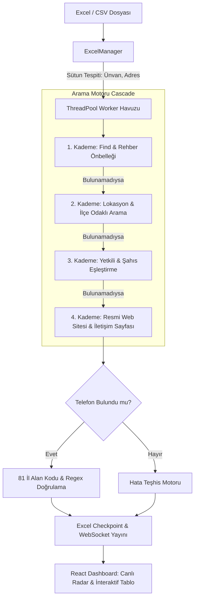

# 🏗️ Sistem Mimarisi & Arama Algoritması

Bu dokümanda **10K Şirket Telefon & AI İstihbarat Agent** projesinin uçtan uca mimarisi, veri akışı ve arama mekanizması detaylandırılmıştır.

---

## 1. Katmanlı Bileşenler

### Frontend (React + TypeScript)
- **Teknoloji:** Vite, React 18, TypeScript, Lucide Icons, Custom Glassmorphism CSS.
- **WebSocket İletişimi:** `ws://127.0.0.1:8000/ws/scan` üzerinden anlık ilerleme, hız, bulunan kayıtlar ve teşhis logları.
- **Sanal Grid Tablosu:** 20.000 satırlık dev veri setlerini donmadan filtreleme, arama ve sıralama.

### Backend (Python FastAPI)
- **Asenkron Motor:** `asyncio` ve `ThreadPoolExecutor` ile 15-35 paralel worker yönetimi.
- **REST Endpoints:** Tablo filtreleme, tekil hücre kaydı, dosya yükleme/indirme ve Find.com.tr proxy sorgulamaları.

---

## 2. 4 Kademeli Arama Cascade Algoritması

1. **Aşama 1 (Doğrulanmış Dizinler):**
   - `site:find.com.tr "{brand}"`, `site:firmatlas.com "{brand}"`, `site:bulurum.com "{brand}"`
   - Arama motorlarının SEO önbelleğindeki açık `Schema.org` ve `meta description` verilerini tarar.

2. **Aşama 2 (Lokasyon Uyumlu Sorgular):**
   - `"{brand}" {ilçe/il} telefon`, `"{brand}" {ilçe/il} iletişim`
   - Şirketin unvanını bulunduğu il/ilçe ile birlikte aratarak adaş firmalardan ayrıştırır.

3. **Aşama 3 (Yetkili Eşleştirmesi):**
   - Küçük işletmeler ve şahıs firmaları için yetkili adı ile şirket unvanını birleştirerek arama yapar.

4. **Aşama 4 (Resmi Web Sitesi Keşfi & İç Link Kazıma):**
   - Şirketin resmi alan adını tespit eder, ana sayfa ve alt linklerdeki (`/iletisim`, `/bize-ulasin`, `/contact`, `/hakkimizda`) `tel:` etiketlerini ve sayfa metinlerini regex ile ayıklar.

---

## 3. Güvenlik & Hata Teşhis Motoru

- **Exact Token Matching:** `NOV` kelimesi `NOVA` kelimesiyle ASLA eşleşmez (Tam kelime sınırı `\b` doğrulaması).
- **Alan Kodu Doğrulama:** İstanbul (212/216), Ankara (312), İzmir (232) vb. 81 ilin resmi kodlarıyla numaranın geçerliliği teyit edilir.
- **Spam / Çöp Filtresi:** Sahibinden, Şikayetvar, Hepsiburada, Trendyol gibi pazar yerleri ve rehber çöplükleri engellenir.
